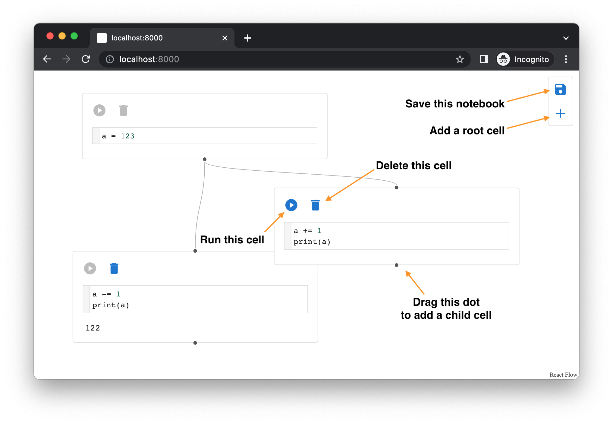

# Multiverse Notebook

A Notebook Environment for Safe and Efficient Exploration

## Run Multiverse Notebook

### With Docker

Requirement: Docker

```sh
# Run Multiverse Notebook in a container
docker run --rm -p 8000:8000 -it ghcr.io/mvnb-research/mvnb:mvnb

# Open http://localhost:8000 in your browser
```

### Without Docker

Requirements: Linux, Python3, NPM, Make

```sh
# Build Multiverse Notebook
make

# Run Multiverse Notebook
./.venv/bin/mvnb

# Open http://localhost:8000 in your browser
```

## Usage



See also [this demo video](https://youtu.be/gNphOyG-o2Y)
